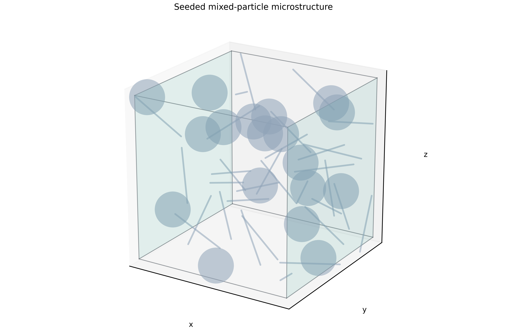
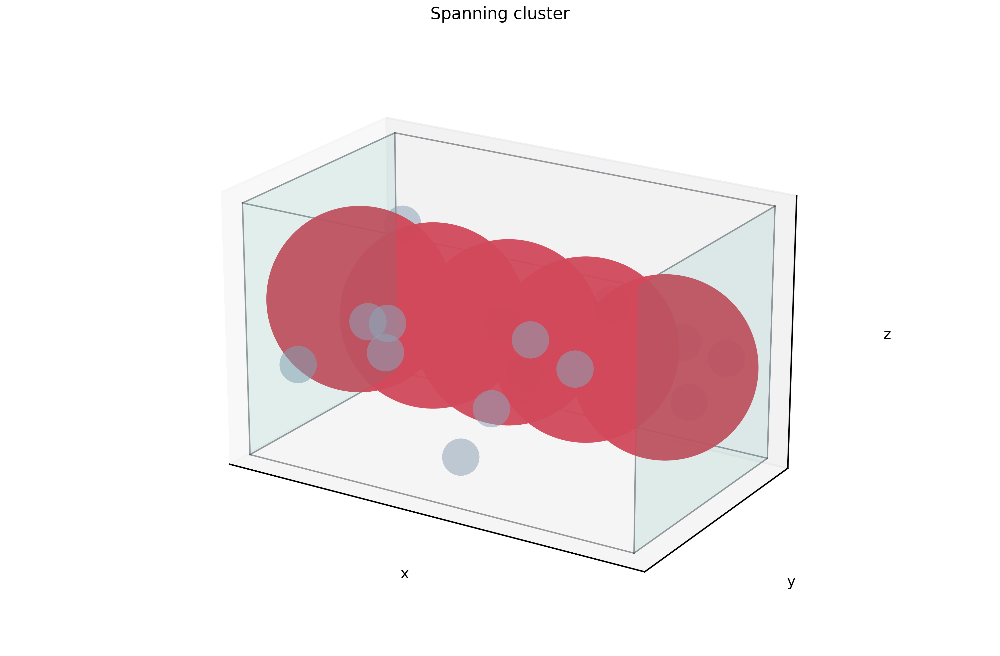
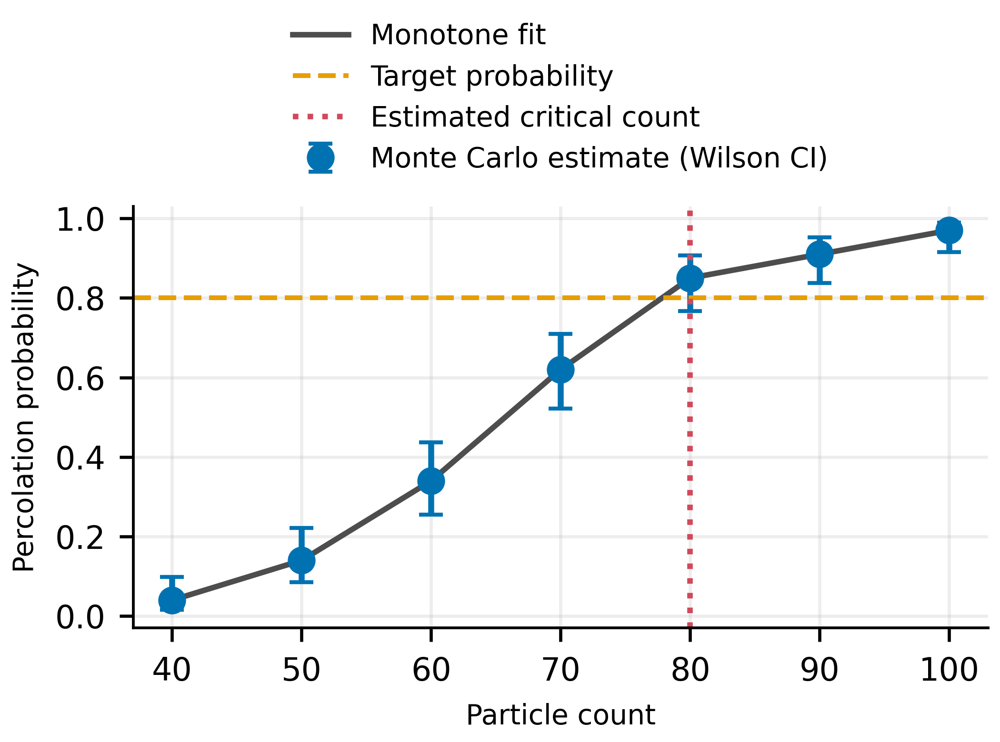
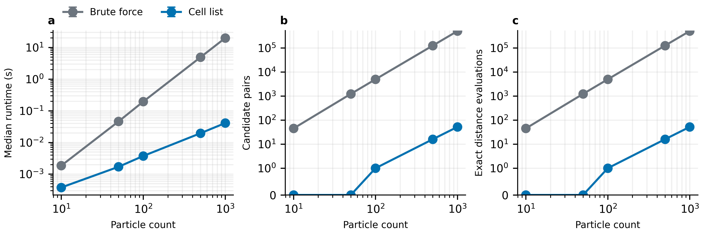

# MicroPerco

[](https://github.com/grazze1/MicroPerco/actions/workflows/ci.yml)
[](https://www.python.org/)
[](LICENSE)

MicroPerco is a reusable scientific-computing framework for three-dimensional microstructure percolation, Monte Carlo uncertainty quantification, critical-loading estimation, and bounded inverse design.



## Overview

MicroPerco turns finite spheres and flat-ended cylinders into an auditable contact graph inside an orthorhombic domain. It supports independently periodic x/y/z boundaries, finite electrode faces, topological winding, an exhaustive geometry oracle, an optimized cell-list search, seeded Monte Carlo trials, and conservative statistical certification.

It is a library and CLI, not a hard-coded solution to one dataset. Units are user-defined but must be internally consistent.

## Why MicroPerco

Microstructure simulations are unusually sensitive to small geometry and boundary-condition shortcuts. Treating a cylinder as a capsule changes end-cap distances; treating a finite electrode as an infinite plane creates false contacts; searching only 27 periodic images can miss long-particle interactions; selecting an optimum from noisy point estimates can overstate confidence.

MicroPerco makes those choices explicit and records enough evidence to audit each result:

- exact accepted edges and their lattice shifts;
- broad-phase candidate and narrow-phase evaluation counts;
- deterministic representative spanning paths or winding vectors;
- point estimates, Wilson intervals, and exact intervals;
- declared family confidence, per-comparison confidence, and comparison counts;
- independent certification samples separated from search/screening samples.

## Features

- Immutable, validated `Sphere`, finite `Cylinder`, `Domain`, material, and population models.
- Analytic sphere–sphere and sphere–cylinder gaps; support-map GJK with a certified convex fallback for flat-cylinder pair and electrode queries.
- Finite rectangular electrode faces, including transverse periodic tiling.
- All eight periodic-axis combinations and dynamically complete image ranges.
- Brute-force reference and periodic AABB cell-list contact searches.
- Union-Find plus independent BFS connectivity checks; weighted lattice winding detection.
- Uniform centers and rotation-invariant cylinder orientations from reproducible NumPy streams.
- Monte Carlo probability estimation with Wilson and Clopper–Pearson intervals.
- Nested PAVA/logistic/probit critical search with independent family-wise certification.
- Complete bounded integer mixture search with cost ordering and fixed-family error control.
- Strict schema-versioned YAML, stable JSON CLI output, plotting, validation, and benchmarks.

## Installation

MicroPerco requires Python 3.10 or newer; CI tests Python 3.10–3.12.

```bash
git clone https://github.com/grazze1/MicroPerco.git
cd MicroPerco
python -m pip install .
```

Install plotting or development support when needed:

```bash
python -m pip install '.[plot]'
python -m pip install -e '.[dev]'
```

HPP-FCL is optional and used only as an external validation backend. It is not needed by the core package.

## Quick Start

This complete example is exercised by `tests/test_readme_examples.py`:

```python
from microperco import (
    Domain,
    SphereSpec,
    ThresholdContactModel,
    MonteCarloSimulator,
)

domain = Domain(
    size=(8.0, 8.0, 8.0),
    periodic=(False, True, True),
)

simulator = MonteCarloSimulator(
    domain=domain,
    particle_specs=[SphereSpec(radius=0.75)],
    contact_model=ThresholdContactModel(0.10),
    axis="x",
)

result = simulator.estimate_probability(
    particle_counts=[24],
    trials=16,
    seed=42,
)

print(result.probability)
print(result.confidence_interval)
```

For a single explicit realization:

```python
from microperco import PopulationSpec, analyze_percolation, generate_microstructure

sample = generate_microstructure(
    domain,
    [PopulationSpec(SphereSpec(0.75), 24, "beads")],
    seed=42,
)
graph = analyze_percolation(
    sample.particles,
    domain,
    ThresholdContactModel(0.10),
    axis="x",
)
print(graph.percolates, graph.spanning_path)
```

## Core Concepts

| Concept | Meaning |
|---|---|
| Domain | A finite orthorhombic box with independent periodic flags and a configurable center |
| Particle | A closed sphere or finite right circular cylinder with flat end caps |
| Contact | Exact non-negative surface gap no larger than a threshold plus scale-aware tolerance |
| Parent | Optional identity used to group explicitly reconstructed periodic fragments |
| Face percolation | A contact-graph path between distinct finite lower and upper electrode faces |
| Periodic wrapping | A graph cycle with non-zero integer lattice winding along the selected periodic axis |
| Nominal volume fraction | Sum of particle volumes divided by domain volume; overlaps are not subtracted |

MicroPerco never infers units. Domain dimensions, radii, lengths, and contact threshold must use the same length unit; material cost per volume must match the desired cost unit.

## Geometry Kernel

Sphere distances and the point-to-flat-cylinder primitive are analytic.
Cylinder–cylinder distance uses a scaled float64 support-map GJK algorithm. If
an ill-conditioned GJK iteration stalls, a convex primal/dual fallback returns
only after its global distance bracket meets the configured tolerance;
otherwise the query fails explicitly. The cell list performs conservative AABB
pruning, and both search backends use the same narrow-phase kernel.

The default `NumericalPolicy` uses a `1e-9` absolute tolerance, a `1e-12` relative tolerance, and at most 128 GJK iterations. Invalid radii, lengths, axes, derived volumes, AABBs, endpoints, and lattice translations fail explicitly.

See [geometry methodology](docs/methodology/geometry.md).

## Periodic Boundary Conditions

`Domain.periodic` is a three-boolean tuple. Relevant lattice translations are solved from AABB overlap intervals, so long bodies can require images beyond immediate neighbors.

Face analysis opens the analysis axis and retains transverse PBC. This preserves two distinct electrodes. Equal non-null `parent_id` values always provide fragment continuity without self-contact edges. Only the historical seam-to-both-electrodes shortcut is enabled by `wrapped_parent=True`.

See [periodic-boundary methodology](docs/methodology/periodic_boundary.md).

## Percolation Analysis

```python
result = analyze_percolation(
    particles,
    domain,
    ThresholdContactModel(0.10),
    axis="x",
    mode="face_to_face",  # or "periodic_wrap"
    search="cell_list",  # or "bruteforce"
    solver="union_find",  # independently checked by BFS
)
```

`PercolationResult` is immutable and includes the decision, mode, axis,
ordinary contact edges, periodic topology evidence, electrode memberships,
representative path, winding, component count, and search-work counters.



## Monte Carlo Simulation

Every trial gets a child `SeedSequence`; the same seed and configuration reproduce the same stream. Results contain both a two-sided Wilson interval and an exact Clopper–Pearson interval. These quantify sampling error under the model, not model-form uncertainty.

The built-in generator uses independent uniform centers and isotropic cylinder axes. It does not impose excluded-volume packing or prevent a body centered inside a non-periodic domain from extending outside it.

See [Monte Carlo methodology](docs/methodology/monte_carlo.md).

## Critical Loading

```python
from microperco import estimate_critical_loading

critical = estimate_critical_loading(
    domain,
    SphereSpec(0.75),
    ThresholdContactModel(0.10),
    loading_grid=(20, 25, 30, 35, 40),
    target_probability=0.90,
    search_trials=1000,
    certification_trials=5000,
    confidence=0.95,
    seed=42,
)
```

Search trials share nested particle prefixes, then PAVA (or a monotone logistic/probit link) proposes the first crossing. New random streams certify the candidate lower bound and, where applicable, the predecessor upper bound. Bonferroni allocation controls the one- or two-assertion family. A result that lacks both required inequalities is `INCONCLUSIVE`.



See [critical-loading methodology](docs/methodology/critical_loading.md).

## Inverse Design

`optimize_mixture` enumerates the full Cartesian product of inclusive count bounds, orders candidates by nominal material cost, screens them, and independently certifies them. If the bounded family has `M` candidates, exact one-sided certification confidence is fixed at `1 - (1 - family_confidence) / (2M)` before sampling.

`CERTIFIED_OPTIMAL` means feasibility was certified and every strictly cheaper evaluated design was excluded at the declared family-wise level. It means optimal only within the provided finite bounds and stochastic model.

See [inverse-design methodology](docs/methodology/inverse_design.md).

## CLI

All computational commands emit standards-compliant JSON (`NaN` and infinity are rejected):

```bash
microperco simulate configs/example.yaml
microperco critical configs/example.yaml
microperco optimize configs/example.yaml
microperco validate
microperco benchmark configs/benchmark.yaml
```

Add `--output result.json` to write JSON to a file. Use `microperco COMMAND --help` for command-specific arguments.

## Configuration

Every YAML document starts with `schema_version: 1`. Unknown keys are errors. The main sections are `domain`, `particles`, `contact`, `percolation`, `simulation`, and optional `critical`, `optimization`, and `benchmark` blocks.

See [the complete generic example](configs/example.yaml). Configuration validation checks shapes, finite physical values, unique population names, modes/backends, count grids and bounds, probability levels, and operation-specific requirements.

## Examples

- [`examples/smoke_test.py`](examples/smoke_test.py): minimal end-to-end Monte Carlo run.
- [`examples/basic_simulation.py`](examples/basic_simulation.py): one mixed realization and graph audit.
- [`examples/critical_loading.py`](examples/critical_loading.py): nested critical-loading workflow.
- [`examples/inverse_design.py`](examples/inverse_design.py): bounded two-material design.
- [`examples/mathematical_modeling_case/`](examples/mathematical_modeling_case/): data-free Q1–Q4 mapping; restricted source attachments are not redistributed.

## Validation

Release validation on Python 3.11.15 produced:

- 303 automated tests passed across analytic geometry, all eight PBC combinations, connectivity, acceleration, statistics, configuration, CLI, and figures;
- 24 cylinder pairs versus SciPy SLSQP: maximum absolute gap error `6.73e-10`;
- the same 24 pairs versus HPP-FCL 2.4.4: maximum absolute gap difference `2.00e-5` (the largest deviations are HPP-FCL's axis-aligned cylinder support offset; all are reported);
- 24 randomized system/PBC comparisons: identical optimized and brute-force contact edges;
- 15 face-to-face and 9 periodic-wrapping cases: Union-Find and BFS decisions agreed;
- 100,000 isotropic directions: coordinate means within `0.0021` of zero and second moments within `0.00038` of `1/3`.

Full commands, acceptance criteria, environment, and limitations are in [the validation report](validation/VALIDATION_REPORT.md). Validation figures and numbers are generated, not hand-entered experimental claims.

## Benchmarks

On the recorded Linux/Python 3.11.15 environment, a sparse periodic sphere benchmark used seed 42, one warmup, and five timed repeats per backend. At `N=1000`, brute force evaluated 499,500 pairs in a median `19.764 s`; the cell list evaluated 52 pairs in `0.04088 s`, a `483.4×` observed speedup for this realization. This is an empirical sparse-case result, not a universal complexity guarantee.



See [the benchmark report](benchmarks/BENCHMARK_REPORT.md) and machine-readable [`benchmark_results.json`](benchmarks/benchmark_results.json).

## Reproducibility

```bash
python -m pytest
python validation/run_validation.py
python validation/run_external_geometry.py --backend scipy
python benchmarks/run_benchmark.py
```

Fixed seeds, exact configuration, quartiles, dependency versions, and immutable result records are retained. Search and certification use independent root-seed branches. The source-integrity and environment records are in [`docs/provenance`](docs/provenance/) and [`docs/development`](docs/development/).

## Project Structure

```text
src/microperco/       geometry, contact, graph, simulation, statistics, I/O, CLI, plots
tests/                unit, integration, regression, and golden cases
validation/           independent geometry and cross-backend validation
benchmarks/           repeatable performance measurements
configs/              generic schema-versioned YAML examples
examples/             runnable API workflows and a data-free case study
docs/                 methodology, provenance, legal, development, and generated assets
.github/               CI, release-artifact preparation, and contribution templates
```

## Roadmap

The following are plans, not current capabilities:

- **v1.x:** additional particle distributions, improved neighbor search, anisotropy analysis, and parallel Monte Carlo.
- **v2.0:** resistor networks, distance-dependent tunneling, effective conductivity, and directional $\sigma_x/\sigma_y/\sigma_z$.
- **Future:** multi-objective design, surrogate models, Bayesian optimization, and GPU acceleration.

## Citation

Use the metadata in [`CITATION.cff`](CITATION.cff). Until a DOI-backed archive exists, cite the software title, version 1.0.0, repository URL, and access date.

## Contributing

See [`CONTRIBUTING.md`](CONTRIBUTING.md) for development gates and numerical-evidence expectations. Conduct is governed by [`CODE_OF_CONDUCT.md`](CODE_OF_CONDUCT.md); private vulnerability reports follow [`SECURITY.md`](SECURITY.md).

## License

Copyright 2026 MicroPerco contributors. Licensed under the [Apache License 2.0](LICENSE). Dependency and asset provenance is documented in [`docs/legal/third_party.md`](docs/legal/third_party.md).
